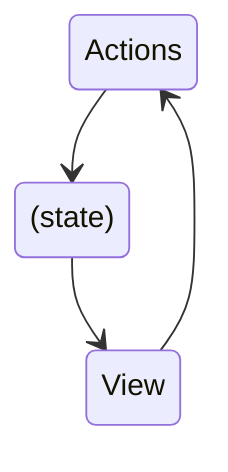

## Redux

**Redux is a library for managing and updating global application state**

> The UI triggers the events called **actions** with describe what happened
> The update logic called **reducers** updates the **state**.

It serves as a certalized store for state that needs to be used across your entire application.

### Redux is more useful when:

- You have large amounts of applicaton state that are needed in many places in the app
- The app state is updated frequently over the time
- The logic to update that state may be complex

**Note: Not all apps need Redux**

#### Key terms and concepts

- The **state**, the source of truth that drives our app
- The **view**, a declarative description of the UI based on the current state
- The **actions**, the events that occur in the app based on used input, and trigger updates in the state



#### Terminology

- **Actions** : Is a plain JS object that has a `type` field.
- **Action Creators** : A function that creates and returns an action object.
- **Reducers** : Is a function that receives the current `state` and an `action` object, decides how to update the state if necessary, and returns the new state `(state, action) => newState`.
- **Store** : The current Redux application state lives here.
- **Dispatch** : The only way to update the state is to call `dispatch()` and pass in an action object.
- **selectors** : Functions that know how to extract specific pieces of information from a store state value.

#### Counter App

##### 1. Creating the Redux Store

`app/store.ts`

```js
import { configureStore } from "@reduxjs/toolkit";
import counterReducer from "../feature/counter/counterSlice";

export const store = configureStore({
    reducer: {
        counter: counterReducer,
    },
});

export type AppStore = typeof store;
export type RootState = ReturnType<AppStore["getState"]>;
export type AppDispatch = AppStore["dispatch"];
```

##### 2.Creating Slice Reducers and Actions

`features/counter/counterSlice.ts`

```js
import { createSlice, type PayloadAction } from "@reduxjs/toolkit";
import type { RootState } from "../../app/store";

export interface CounterState {
    value: number;
}

const initialState: CounterState = {
    value: 0,
};

const counterSlice = createSlice({
    name: "counter",
    initialState,
    reducers: {
        increment: (state) => {
        state.value += 1;
        },
        decrement: (state) => {
        state.value -= 1;
        },
        incrementByValue: (state, action: PayloadAction<number>) => {
        state.value += action.payload;
        },
    },
});

export const { increment, decrement } = counterSlice.actions;
export const selectCount = (state: RootState) => state.counter.value;
export default counterSlice.reducer;

```

##### 3. Reading Data and Dispatching Actions

```js
const Counter = () => {
  const dispatch = useAppDispatch();
  const count = useAppSelector(selectCount);

  return (
    <>
      <h2>Counter App</h2>
      <p>counter : {count}</p>
      <section>
        <button onClick={() => dispatch(increment())}>Increment</button>
        <button onClick={() => dispatch(decrement())}>Decrement</button>
      </section>
    </>
  );
};
```
