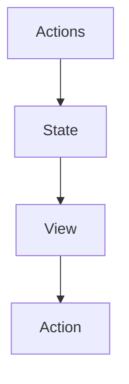

## Redux

**Redux is a library for managing and updating global application state**

> The UI triggers the events called **actions** with describe what happened
> The update logic called **reducers** updates the **state**.

It serves as a certalized store for state that needs to be used across your entire application.

### Redux is more useful when:

- You have large amounts of applicaton state that are needed in many places in the app
- The app state is updated frequently over the time
- The logic to update that state may be complex

**Note: Not all apps need Redux**

#### Key terms and concepts

- The **state**, the source of truth that drives our app
- The **view**, a declarative description of the UI based on the current state
- The **actions**, the events that occur in the app based on used input, and trigger updates in the state

#### Terminology

- **Actions** : Is a plain JS object that has a `type` field.
- **Action Creators** : A function that creates and returns an action object.
- **Reducers** : Is a function that receives the current `state` and an `action` object, decides how to update the state if necessary, and returns the new state `(state, action) => newState`.
- **Store** : The current Redux application state lives here.
- **Dispatch** : The only way to update the state is to call `dispatch()` and pass in an action object.
- **selectors** : Functions that know how to extract specific pieces of information from a store state value.
