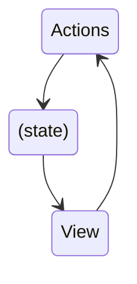
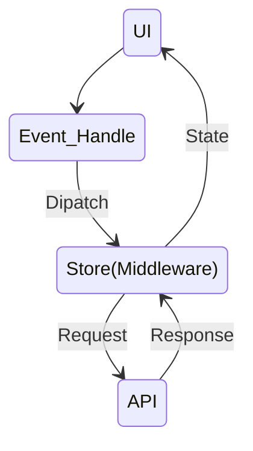

## Redux

**Redux is a library for managing and updating global application state**

> The UI triggers the events called **actions** with describe what happened
> The update logic called **reducers** updates the **state**.

It serves as a certalized store for state that needs to be used across your entire application.

### Redux is more useful when:

- You have large amounts of applicaton state that are needed in many places in the app
- The app state is updated frequently over the time
- The logic to update that state may be complex

**Note: Not all apps need Redux**

#### Key terms and concepts

- The **state**, the source of truth that drives our app
- The **view**, a declarative description of the UI based on the current state
- The **actions**, the events that occur in the app based on used input, and trigger updates in the state



#### Terminology

- **Actions** : Is a plain JS object that has a `type` field.
- **Action Creators** : A function that creates and returns an action object.
- **Reducers** : Is a function that receives the current `state` and an `action` object, decides how to update the state if necessary, and returns the new state `(state, action) => newState`.
- **Store** : The current Redux application state lives here.
- **Dispatch** : The only way to update the state is to call `dispatch()` and pass in an action object.
- **selectors** : Functions that know how to extract specific pieces of information from a store state value.

### Simple Example : 1. Counter App

##### 1. Creating the Redux Store

`app/store.ts`

```js
import { configureStore } from "@reduxjs/toolkit";
import counterReducer from "../feature/counter/counterSlice";

export const store = configureStore({
    reducer: {
        counter: counterReducer,
    },
});

export type AppStore = typeof store;
export type RootState = ReturnType<AppStore["getState"]>;
export type AppDispatch = AppStore["dispatch"];
```

##### 2.Creating Slice Reducers and Actions

**A "slice" is a collection of Redux reducer logic and actions for a single feature in app**

`features/counter/counterSlice.ts`

```js
import { createSlice, type PayloadAction } from "@reduxjs/toolkit";
import type { RootState } from "../../app/store";

export interface CounterState {
    value: number;
}

const initialState: CounterState = {
    value: 0,
};

const counterSlice = createSlice({
    name: "counter",
    initialState,
    reducers: {
        increment: (state) => {
            state.value += 1;
        },
        decrement: (state) => {
            state.value -= 1;
        },
        incrementByValue: (state, action: PayloadAction<number>) => {
            state.value += action.payload;
        },
    },
});

export const { increment, decrement } = counterSlice.actions;
export const selectCount = (state: RootState) => state.counter.value;
export default counterSlice.reducer;

```

##### 3. Reading Data and Dispatching Actions

```js
const Counter = () => {
  const dispatch = useAppDispatch();
  const count = useAppSelector(selectCount);

  return (
    <>
      <h2>Counter App</h2>
      <p>counter : {count}</p>
      <section>
        <button onClick={() => dispatch(increment())}>Increment</button>
        <button onClick={() => dispatch(decrement())}>Decrement</button>
      </section>
    </>
  );
};
```

---

---

#### `extraReducers` to Handle Other Actions

Which can be used to have the slice listen for actions that were defined elsewhere in the app. Any time those other actions are dispatched, this slice. can update its own state as well.

```ts
const postsSlice = createSlice({
  name: "posts",
  initialState,
  reducers: {
    postAdded: {
      reducer(state, action) {
        state.push(action.payload);
      },
      prepare(title: string, content: string, userId: string) {
        console.log("prepate", title, content);
        return {
          payload: {
            id: nanoid(),
            title,
            content,
            date: new Date().toISOString(),
            user: userId,
            reactions: {
              likes: 0,
              dislikes: 0,
            },
          },
        };
      },
    },
    postUpdated: (state, action) => {
      const { id, title, content } = action.payload;
      const existingPost = state.find((post) => post.id === id);
      if (existingPost) {
        existingPost.title = title;
        existingPost.content = content;
      }
    },
    postDeleted: (state, action) => {},
    reactionsAdded: (state, action) => {
      const { postId, reaction } = action.payload as {
        postId: string;
        reaction: keyof Reactions;
      };
      const existingPost = state.find((post) => post.id === postId);
      if (existingPost) {
        existingPost.reactions[reaction]++;
      }
    },
  },
  extraReducers: (builder) => {
    builder.addCase(userLoggedOut, (state) => {
      return [];
    });
  },
});
```

**Use `extraReducers` to handle actions that were defined outside of the slice.**

### Using Middleware to Enable Async Logic

**Redux Middleware** this extend the store to add additional capabilities, and allow you to:

- Execute extra logic when any action is dispatched
- Pause, modify, delay, replace, or halt dispatched actions
- Write code that uses async logic or other side effects

#### Middleware and Redux Data Flow

Middleware update the Redux data flow by adding an extra step at the start of `dispatch`. That way, middleware can run logic like HTTP requests, then dispatch actions.



##### Thunks and Async Logic

`redux-thunk` - async middleware, which lets you write plain functions that may contain async logic directly.

Note: "thunk" - programming term that means "a piece of code that does some delayed work"

- `createAsyncThunk` accepts a "payload creator" callback that should return a Promise, and generate `pending/fulfilled/rejected` action types automatically
- You can listen for these action types in `createSlice` using `extraReducer` field, and update the state in reducers based on thosed actions
- `createAsyncThunk` has a `condition` option that can be used to cancel a request based on the Redux state
- Thunks can return promises. For `createAsyncThunk` specifically, you can `await` `dispatch(someThunk()).unwrap()` to handle the request success or failure at the component level.

`post-app/src/features/posts/postsSlice.ts`

```ts
import { createSlice, nanoid } from "@reduxjs/toolkit";
import { sub } from "date-fns";

import type { RootState } from "../../app/store";
import { userLoggedOut } from "../auth/authSlice";
import { client } from "../../api/client";
import { createAppAsyncThunk } from "../../app/withTypes";

export const fetchPosts = createAppAsyncThunk(
  "posts/fetchPosts",
  async () => {
    const response = await client.get<Post[]>("/fakeApi/posts");
    console.log("response", response);
    return response.data;
  },
  {
    condition(arg, thunkApi) {
      const postsStatus = selectPostsStatus(thunkApi.getState());
      if (postsStatus !== "idle") {
        return false;
      }
    },
  },
);

export const addNewPost = createAppAsyncThunk(
  "posts/addNewPost",
  async (initialPost) => {
    const response = await client.post<Post>("/fakeApi/posts", initialPost);
    return response.data;
  },
);

export interface Reactions {
  likes: number;
  dislikes: number;
}

export type ReactionName = keyof Reactions;

export interface Post {
  id: string;
  title: string;
  content: string;
  user?: string;
  date: string;
  reactions: Reactions;
}

interface PostsState {
  posts: Post[];
  status: "idle" | "pending" | "succeeded" | "failed";
  error: string | null;
}

const initialState: PostsState = {
  posts: [],
  status: "idle",
  error: null,
};

const postsSlice = createSlice({
  name: "posts",
  initialState,
  reducers: {
    postUpdated: (state, action) => {
      const { id, title, content } = action.payload;
      const existingPost = state.posts.find((post) => post.id === id);
      if (existingPost) {
        existingPost.title = title;
        existingPost.content = content;
      }
    },
    postDeleted: (state, action) => {},
    reactionsAdded: (state, action) => {
      const { postId, reaction } = action.payload as {
        postId: string;
        reaction: keyof Reactions;
      };
      const existingPost = state.find((post) => post.id === postId);
      if (existingPost) {
        existingPost.reactions[reaction]++;
      }
    },
  },
  extraReducers: (builder) => {
    builder
      .addCase(userLoggedOut, (state) => {
        return initialState;
      })
      .addCase(fetchPosts.pending, (state, action) => {
        state.status = "pending";
      })
      .addCase(fetchPosts.fulfilled, (state, action) => {
        state.status = "succeeded";
        // Add any fetched posts to the array
        state.posts.push(...action.payload);
      })
      .addCase(fetchPosts.rejected, (state, action) => {
        state.status = "failed";
        state.error = action.error.message ?? "Unknown Error";
      })
      .addCase(addNewPost.fulfilled, (state, action) => {
        // We can directly add the new post object to our posts array
        state.posts.push(action.payload);
      });
  },
});

export const { postUpdated, reactionsAdded } = postsSlice.actions;

export const selectAllPosts = (state: RootState) => state.posts.posts;

export const selectPostById = (state: RootState, postId: string) =>
  state.posts.posts.find((post: Post) => post.id === postId);

export const selectPostsStatus = (state: RootState) => state.posts.status;
export const selectPostsError = (state: RootState) => state.posts.error;

export default postsSlice.reducer;
```

### Improving Rendering Performance

- **Memoizing selector function** - `createSelector` function that generates memoized selectors that will only recalculate results when the input change.

```ts
import {
  createSlice,
  createAsyncThunk,
  createSelector,
} from "@reduxjs/toolkit";

export const selectAllPosts = (state: RootState) => state.posts.posts;

export const selectPostById = (state: RootState, postId: string) =>
  state.posts.posts.find((post) => post.id === postId);

export const selectPostsByUser = createSelector(
  [selectAllPosts, (state: RootState, userId: string) => userId],
  (posts, userId) => posts.filter((post) => post.user === userId),
);
```

Note: **all selectors in an application need to be memoized!**

#### Normalizing Data

**"Normalized state"** means,

- We only have one copy of each particular piece of data in our state, so theres no duplication
- Data that has been normalized is kept in a lookup table, where the item IDs are the keys, and the items themselves are the values. This is typically just a plain JS object.
- There may also be an array of all of the IDs for a particular item type.

```js
{
  users: {
    ids: ["user1", "user2", "user3"],
    entities: {
      "user1": {id: "user1", firstName, lastName},
      "user2": {id: "user2", firstName, lastName},
      "user3": {id: "user3", firstName, lastName},
    }
  }
}
```

```js
const userId = "user2";
const userObject = state.users.entities[userId];
```

##### Managing Normalized State with `createEntityAdapter`

`createEntityAdapter` API provides a standardized way to store your data, which putting them into the shape of `{ ids: [], entities: {} }`

```ts
import { createSlice, createEntityAdapter } from "@reduxjs/toolkit";
import { client } from "../api/client";
import { createAppAsyncThunk } from "../app/withTypes";

const usersAdapter = createEntityAdapter<User>();

const initialState = usersAdapter.getInitialState();

export const fetchUsers = createAppAsyncThunk("users/fetchUsers", async () => {
  const response = await client.get("/fakeApi/users");
  return response.users;
});

const usersSlice = createSlice({
  name: "users",
  initialState,
  reducers: {},
  extraReducers(builder) {
    builder.addCase(fetchUsers.fulfilled, usersAdapter.setAll);
  },
});

export default usersSlice.reducer;

export const { selectAll: selectAllUsers, selectById: selectUserById } =
  usersAdapter.getSelectors((state: RootState) => state.users);

export const selectCurrentUser = (state: RootState) => {
  const currentUsername = selectCurrentUsername(state);
  if (!currentUsername) {
    return;
  }
  return selectUserById(state, currentUsername);
};
```

#### Writing Reactive Logic

Sometimes we need to write more logic that runs in response to things that happened in the app, such as certain actions being dispatched.

##### Reactive Logic with `createListenerMiddleware`

**Redux Toolkit includes the `createListenerMiddleware` API to let us write logic that runs in response to specific actions being dispatched.**

`app/listenerMiddleware.ts`

```ts
import { createListenerMiddleware, addListener } from "@reduxjs/toolkit";
import type { RootState, AppDispatch } from "./store";

export const listenerMiddleware = createListenerMiddleware();

export const startAppListening = listenerMiddleware.startListening.withTypes<
  RootState,
  AppDispatch
>();
export type AppStartListening = typeof startAppListening;

export const addAppListener = addListener.withTypes<RootState, AppDispatch>();
export type AppAddListener = typeof addAppListener;
```

`app/store.ts`

```ts
import { configureStore } from '@reduxjs/toolkit'

import authReducer from '@/features/auth/authSlice'
import postsReducer from '@/features/posts/postsSlice'
import usersReducer from '@/features/users/usersSlice'
import notificationsReducer from '@/features/notifications/notificationsSlice'

import { listenerMiddleware } from './listenerMiddleware'

export const store = configureStore({
  reducer: {
    auth: authReducer,
    posts: postsReducer,
    users: usersReducer,
    notifications: notificationsReducer
  },
  middleware: getDefaultMiddleware =>
    getDefaultMiddleware().prepend(listenerMiddleware.middleware)

```

`features/posts/postsSlice.ts`

```ts
import {
  createEntityAdapter,
  createSelector,
  createSlice,
  EntityState,
  PayloadAction,
} from "@reduxjs/toolkit";
import { client } from "@/api/client";

import type { RootState } from "@/app/store";
import { AppStartListening } from "@/app/listenerMiddleware";
import { createAppAsyncThunk } from "@/app/withTypes";

// omit types, initial state, slice definition, and selectors

export const selectPostsStatus = (state: RootState) => state.posts.status;
export const selectPostsError = (state: RootState) => state.posts.error;

export const addPostsListeners = (startAppListening: AppStartListening) => {
  startAppListening({
    actionCreator: addNewPost.fulfilled,
    effect: async (action, listenerApi) => {
      const { toast } = await import("react-tiny-toast");

      const toastId = toast.show("New post added!", {
        variant: "success",
        position: "bottom-right",
        pause: true,
      });

      await listenerApi.delay(5000);
      toast.remove(toastId);
    },
  });
};
```

`app/listenerMiddleware.ts`

```ts
// ...

// Call this and pass in `startAppListening` to let the
// posts slice set up its listeners
addPostsListeners(startAppListening);
```
